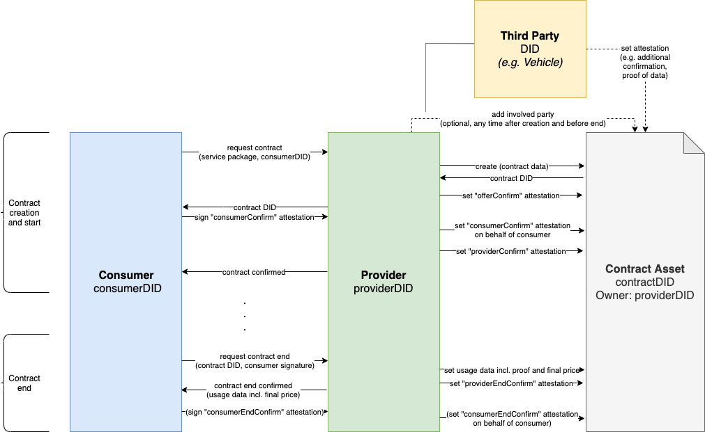

# BloXmove Dev : Generalized Contracting Flow
## Single Contract
Based on the asset and attestation concept described in the [Core mechanisms](Markdown/Technical%20Documentation/Architecture%20Overview/Core-mechanisms_1593933450.md) , the basic contracting flow consists of the following assets (all represented by DID) and a series of attestations:

- _Consumer_: requesting and consuming a service

- _Provider_: offering and granting a service

- _Contract asset_: created by the provider who then becomes the owner of the asset, having a mandatory contractData property containing information about the content of the contract

- Optional _third party assets_: additional parties involved in a contract, e.g. the vehicle asset in a rental contract

The flow and attestations are depicted in the following diagram:

### Contract creation and start
1. _Consumer_ requests a contract indicating the service it wants to book and its consumer DID

2. _Provider_ validates the request and creates a contract with the required contract data, after creation receives the DID of the new contract asset

3. _Provider_ sets a offerConfirm attestation on the contract asset

4. _Provider_ returns contract DID to Consumer

5. _Consumer_ signs consumerConfirm attestation on the contract asset and sends it to Provider

6. _Provider_ validates consumerConfirm attestation and sets it on behalf of the Consumer

7. _Provider sets providerConfirm_ attestation on the contract asset

8. Optional: _Provider_ adds further involved parties to the contract asset, involved parties can then also set attestations to the contract asset

With all above required attestations in place, the contract is confirmed and active.

### Contract end

1. Consumer requests end of contract indicating the contract DID and a Consumer signature

2. Provider validates Consumer signature, determines usage data including an optional proof of the data (like signatures or hashes of raw data) and final price, sets the usage data in the contract asset

3. Provider sets providerEndConfirm attestation on the contract asset, returns usage data to Consumer

4. Optional: Consumer signs consumerEndConfirm attestation on the contract asset and sends it to Provider

5. Optional: Provider validates consumerEndConfirm attestation and sets in on behalf of the Consumer

## Combining Contracts
This generalised flow of a contract start and end can now be applied in many different scenarios, including combinations of contracts in various ways, e.g. in a B2C + B2B backfill scenario as the following:

- User A requests a contract from _MSP B_, resulting in _Contract A ↔︎ B_ with User A as the Consumer and _MSP B _as the Provider.

- To fulfil the duties towards _User A, MSP B_ requests another contract from _Fleet Owner C_, resulting in a _Contract B ↔︎ C_ with MSP B as the Consumer and Fleet Owner C as the Provider.

- _Contract A ↔︎ B_ may have an optional reference to Contract B ↔︎ C (alternatively MSP B could store a mapping of related contracts within its own backend)

- The classification B2C vs. B2B is only relevant from a business perspective, technically both contracts are the same and follow the same flow.

